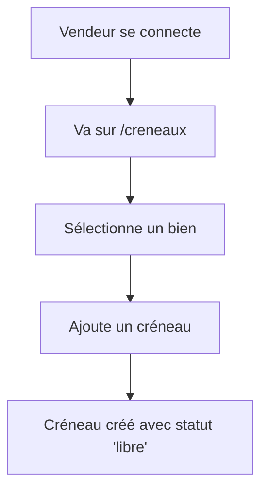
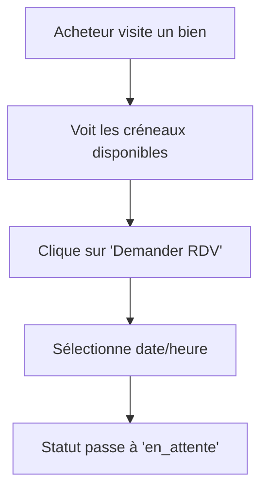
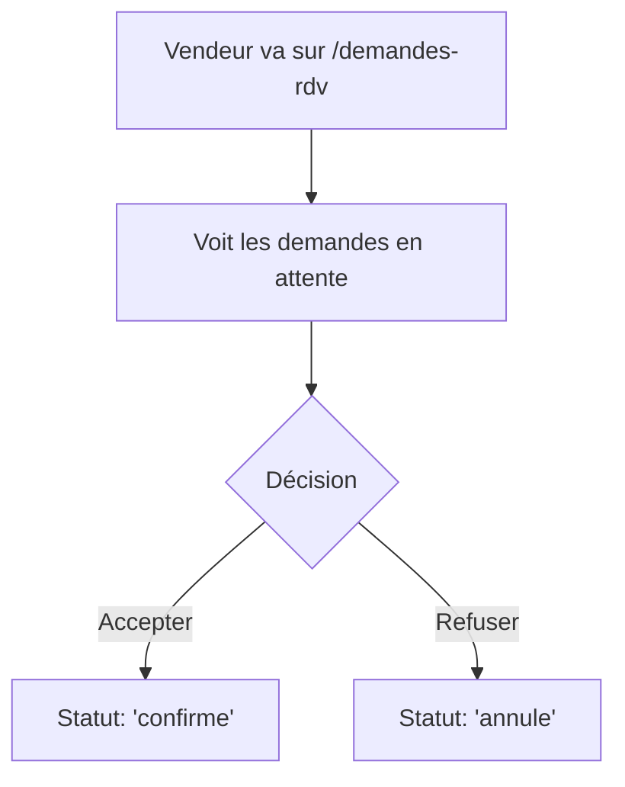

# 📅 Système de Rendez-vous - Karya.tn

## 🎯 Vue d'ensemble

Le système de rendez-vous permet aux acheteurs de demander des visites pour les biens immobiliers et aux vendeurs de gérer ces demandes efficacement.

## 🏗️ Architecture

### Base de données
- **Table `creneaux`** : Stocke les créneaux de visite et les demandes de RDV
- **Statuts** : `libre`, `en_attente`, `confirme`, `annule`
- **Relations** : Vendeur ↔ Bien ↔ Acheteur

### API Endpoints

#### Pour les vendeurs
```
GET /api/creneaux                    # Tous les créneaux du vendeur
POST /api/creneaux                   # Créer un nouveau créneau
PUT /api/creneaux/:id                # Modifier un créneau
DELETE /api/creneaux/:id             # Supprimer un créneau
GET /api/creneaux/demandes           # Demandes de RDV reçues
PUT /api/rdv/:id/accepter            # Accepter une demande
PUT /api/rdv/:id/refuser             # Refuser une demande
```

#### Pour les acheteurs
```
GET /api/creneaux/bien/:id           # Créneaux disponibles pour un bien
POST /api/rdv/demander               # Demander un RDV
GET /api/creneaux/mes-rdv            # Mes rendez-vous
PUT /api/rdv/:id/annuler             # Annuler un RDV
```

## 🔄 Flux de fonctionnement

### 1. Création de créneaux (Vendeur)


### 2. Demande de RDV (Acheteur)


### 3. Gestion des demandes (Vendeur)


## 🎨 Interface utilisateur

### Pages vendeur
- **`/creneaux`** : Gestion des créneaux de visite
- **`/demandes-rdv`** : Demandes de RDV reçues

### Pages acheteur
- **`/mes-rdv`** : Mes rendez-vous programmés
- **Détail bien** : Demander un RDV directement

## 📊 Données retournées

### Demande de RDV (vendeur)
```json
{
  "id": 6,
  "date_debut": "2025-06-06T16:00:00.000Z",
  "date_fin": "2025-06-06T17:00:00.000Z",
  "statut": "en_attente",
  "bien_titre": "Appartement Test Chat",
  "bien_ville": "Tunis",
  "bien_adresse": "123 Rue Test",
  "acheteur_nom": "Dupont",
  "acheteur_prenom": "Jean",
  "acheteur_email": "acheteur@test.com",
  "acheteur_telephone": "+216 12 345 678"
}
```

### RDV acheteur
```json
{
  "id": 6,
  "date_debut": "2025-06-06T16:00:00.000Z",
  "date_fin": "2025-06-06T17:00:00.000Z",
  "statut": "confirme",
  "bien_titre": "Appartement Test Chat",
  "bien_prix": 250000,
  "vendeur_nom": "Martin",
  "vendeur_prenom": "Marie",
  "vendeur_email": "vendeur@test.com",
  "vendeur_telephone": "+216 98 765 432"
}
```

## 🔧 Configuration

### Variables d'environnement
```env
# Base de données
DATABASE_URL=./database.sqlite

# JWT
JWT_SECRET=your_jwt_secret_key

# API
PORT=3000
NODE_ENV=development
```

### Permissions
- **Vendeurs** : Peuvent créer des créneaux et gérer les demandes
- **Acheteurs** : Peuvent demander des RDV et voir leurs rendez-vous
- **Admins** : Accès complet à tous les rendez-vous

## 🧪 Tests

### Test automatisé
```bash
node test-rdv-system.js
```

### Test manuel
1. **Vendeur** : http://localhost:3001/demandes-rdv
2. **Acheteur** : http://localhost:3001/mes-rdv

## 🚀 Déploiement

### Prérequis
- Node.js 16+
- SQLite 3
- React 18

### Installation
```bash
# Backend
npm install
node server.js

# Frontend
cd frontend
npm install
npm start
```

## 📈 Métriques

### Statuts des RDV
- **libre** : Créneau disponible
- **en_attente** : Demande en cours
- **confirme** : RDV confirmé
- **annule** : RDV annulé

### Notifications (à implémenter)
- Email de confirmation
- Rappels de RDV
- Notifications push

## 🔮 Évolutions futures

### Fonctionnalités prévues
- [ ] Notifications en temps réel
- [ ] Calendrier intégré
- [ ] Rappels automatiques
- [ ] Évaluation post-visite
- [ ] Synchronisation calendrier externe
- [ ] Chat intégré pendant la visite

### Améliorations techniques
- [ ] Cache Redis pour les créneaux
- [ ] WebSockets pour les mises à jour temps réel
- [ ] API GraphQL
- [ ] Tests unitaires complets
- [ ] Monitoring et analytics

## 🐛 Dépannage

### Problèmes courants

#### Erreur "Créneau non disponible"
- Vérifier que le créneau existe
- Vérifier le statut (doit être 'libre')
- Vérifier les permissions utilisateur

#### Demandes non visibles
- Vérifier l'authentification
- Vérifier le rôle utilisateur (vendeur/acheteur)
- Vérifier les données en base

#### Erreurs de validation
- Vérifier le format des dates (ISO 8601)
- Vérifier les IDs (entiers positifs)
- Vérifier les champs requis

### Logs utiles
```bash
# Logs serveur
tail -f logs/server.log

# Logs base de données
sqlite3 database.sqlite ".log stdout"
```

## 📞 Support

Pour toute question ou problème :
- **Documentation** : `/docs`
- **API** : http://localhost:3000
- **Issues** : GitHub Issues
- **Email** : support@karya.tn
